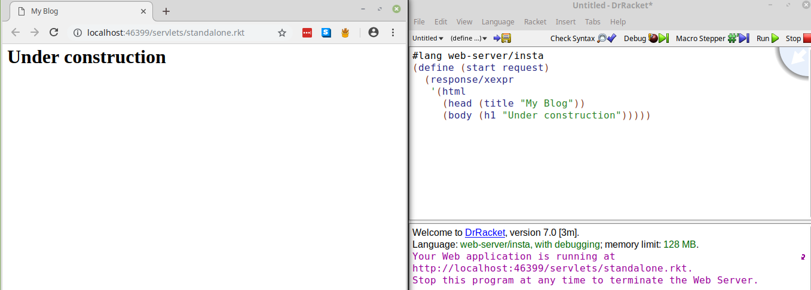

## Why make a website in Racket?
Racket gives lots of different functionality and is incredibly easy to program in. In fact, the [HackerNews](https://news.ycombinator.com/) is run in a single-threaded Racket process using the Arc language mode.
Plus I'm currently in a Web Dev class so let's use it to make a website.

## Beginning
Beginning to start the process was really easy. There's a ton great documentation on [web hosting in racket](https://docs.racket-lang.org/continue/). The documentation goes over making a blog, so I figured I'd give that a go. The beginnign was pretty simple and, thanks to the DrRacket, can be ran directly from the IDE. 
