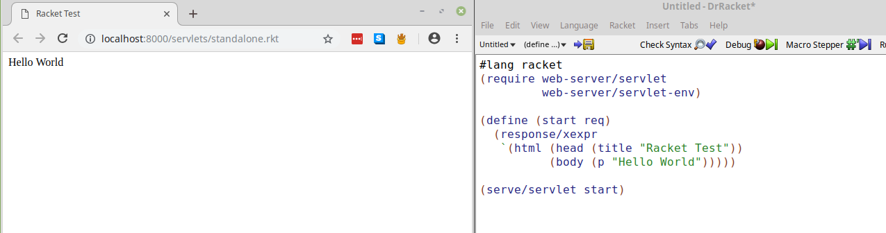

## Why make a website in Racket?
Racket gives lots of different functionality and is incredibly easy to program in. In fact, the [HackerNews](https://news.ycombinator.com/) is run in a single-threaded Racket process using the Arc language mode.
Plus I'm currently in a Web Dev class so let's use it to make a website.

## Beginning
Beginning to start the process was really easy. There's a ton great documentation on [web hosting in racket](https://docs.racket-lang.org/continue/). The documentation goes over making a blog, so I figured I'd give that a go. The beginning was pretty simple and, thanks to the DrRacket, can be ran directly from the IDE. 

## Description
The typical start for a Racket document is ```#lang Racket``` which uses the default Racket language. This can be done through the Racket  
For use in web development the ```#lang web-server/insta```language, which matches the Racket syntax but uses different commands.  Using the web-server/insta language comes with benefits of settings ports, handle styling, SSL, etc.


## What I did
I used the documentation to create the folling website , which can be accessed at [http://thedavidemily.com:3000/servlets/standalone.rkt](http://thedavidemily.com:3000/servlets/standalone.rkt)
